# NTP Clock Display and Improv WiFi Flow

```mermaid
flowchart TD
    Start([Device Boots]) --> SerialInit[Initialize Serial<br/>Wait for USB CDC enumeration]
    SerialInit --> WiFiInit[Initialize WiFi STA mode<br/>Generate AP SSID from MAC]
    WiFiInit --> ImprovSetup[Setup Improv WiFi<br/>- Set device info<br/>- Register callbacks<br/>- onImprovWiFiConnect<br/>- onImprovWiFiConnected]
    
    ImprovSetup --> GracePeriod{Improv Grace Period<br/>10 seconds}
    GracePeriod -->|Process Improv commands| HandleImprov[improvSerial.handleSerial]
    HandleImprov -->|WiFi Connected?| CheckConnected{WiFi.status ==<br/>WL_CONNECTED?}
    CheckConnected -->|Yes| ImprovConnected[Set improvConnected = true<br/>Break grace period]
    CheckConnected -->|No| GraceTimeout{Timeout<br/>reached?}
    GraceTimeout -->|No| GracePeriod
    GraceTimeout -->|Yes| GraceEnd[Grace period ended]
    ImprovConnected --> GraceEnd
    
    GraceEnd --> HWInit[Hardware Initialization<br/>- Pins<br/>- SPI<br/>- Display<br/>- Load Preferences]
    HWInit --> ShowVersion[Display Version<br/>FIRMWARE_VERSION<br/>for 5 seconds]
    ShowVersion --> SetVersionFlags[showingVersion = true<br/>versionStartTime = millis]
    
    SetVersionFlags --> CheckWiFiStatus{WiFi Connected<br/>via Improv?}
    CheckWiFiStatus -->|Yes| SetConnFlag[showConnAfterVersion = true]
    CheckWiFiStatus -->|No| CheckSavedCreds{Saved WiFi<br/>Credentials<br/>exist?}
    
    CheckSavedCreds -->|Yes| TryConnect[WiFi.begin saved SSID/password<br/>Wait up to 15 seconds]
    TryConnect --> ConnectResult{Connected?}
    ConnectResult -->|Yes| SetConnFlag
    ConnectResult -->|No| APModeSetup[Enter AP Mode<br/>- WiFi.mode WIFI_AP<br/>- Start softAP<br/>- Start web server<br/>- showAPAfterVersion = true]
    
    SetConnFlag --> LoopStart[Enter loop]
    APModeSetup --> LoopStart
    
    LoopStart --> ProcessImprov[Process Improv commands<br/>improvSerial.handleSerial]
    ProcessImprov --> CheckVersion{showingVersion<br/>== true?}
    
    CheckVersion -->|Yes| VersionTimeout{5 seconds<br/>elapsed?}
    VersionTimeout -->|No| Return[return - don't touch display]
    VersionTimeout -->|Yes| ClearVersion[showingVersion = false<br/>display.clear]
    ClearVersion --> ShowConnOrAP{showConnAfterVersion<br/>or<br/>showAPAfterVersion?}
    ShowConnOrAP -->|Conn| DisplayConn[Display 'Conn'<br/>1 second]
    ShowConnOrAP -->|AP| DisplayAP[Display 'AP'<br/>1 second]
    DisplayConn --> ClearFlags[Clear flags]
    DisplayAP --> ClearFlags
    ClearFlags --> CheckAPMode
    
    CheckVersion -->|No| CheckAPMode{apMode == true?}
    
    CheckAPMode -->|Yes| CheckWiFiInAP{WiFi.status ==<br/>WL_CONNECTED?}
    CheckWiFiInAP -->|Yes - Improv connected!| ExitAP[Exit AP Mode<br/>- apMode = false<br/>- wifiConnected = true<br/>- showIPAddress = true<br/>- resetIPScrolling = true<br/>- Stop AP<br/>- Configure NTP<br/>- Play beeps]
    ExitAP --> CheckAPMode
    CheckWiFiInAP -->|No| APDisplay[Scroll AP IP address<br/>192.168.4.1<br/>Continuously]
    APDisplay --> APHandle[server.handleClient<br/>handleButtons]
    APHandle --> Return
    
    CheckAPMode -->|No| WiFiMode[WiFi Mode]
    WiFiMode --> WiFiHandle[server.handleClient<br/>handleButtons]
    WiFiHandle --> CheckIPDisplay{showIPAddress &&<br/>wifiConnected?}
    
    CheckIPDisplay -->|Yes| ResetCheck{resetIPScrolling<br/>== true?}
    ResetCheck -->|Yes| ResetScroll[Reset static variables<br/>ipScrollingStarted = false<br/>ipStartTime = 0<br/>display.clear]
    ResetCheck -->|No| CheckScrollStarted{ipScrollingStarted<br/>== false?}
    ResetScroll --> CheckScrollStarted
    CheckScrollStarted -->|No - not started| StartScroll[Start scrolling WiFi IP<br/>ipScrollingStarted = true<br/>ipStartTime = millis]
    StartScroll --> ScrollTimeout{13 seconds<br/>elapsed?}
    CheckScrollStarted -->|Yes - scrolling| ScrollTimeout
    ScrollTimeout -->|No| Return
    ScrollTimeout -->|Yes| StopScroll[showIPAddress = false<br/>ipScrollingStarted = false<br/>display.clear]
    StopScroll --> CheckTimeSync
    
    CheckIPDisplay -->|No| CheckTimeSync{timeSynced ==<br/>true?}
    StopScroll --> CheckTimeSync
    
    CheckTimeSync -->|No| SyncTime[Sync NTP time<br/>configTime<br/>Wait for sync]
    SyncTime --> SyncResult{Time<br/>synced?}
    SyncResult -->|Yes| SetSynced[timeSynced = true<br/>Play two-tone beep]
    SyncResult -->|No| Return
    SetSynced --> DisplayTime
    
    CheckTimeSync -->|Yes| DisplayTime[Display Time<br/>HHMM format<br/>Decimal point flashes<br/>Updates every second]
    DisplayTime --> Return
    
    Return --> LoopStart
    
    style Start fill:#90EE90
    style ImprovConnected fill:#FFD700
    style ExitAP fill:#FFD700
    style DisplayTime fill:#87CEEB
    style APDisplay fill:#FFA07A
    style DisplayConn fill:#98FB98
    style DisplayAP fill:#FFA07A
```

## Key States and Transitions

### Boot Sequence
1. **Serial Initialization**: Wait for USB CDC enumeration (ESP32-S3)
2. **WiFi Initialization**: Set STA mode, generate unique AP SSID
3. **Improv WiFi Setup**: Register callbacks for provisioning
4. **Grace Period**: 10 seconds to receive Improv WiFi commands
5. **Hardware Init**: Pins, SPI, Display, Preferences

### Display Sequence
1. **Version Display**: Shows firmware version for 5 seconds (protected by `showingVersion` flag)
2. **Connection Status**: Shows "Conn" if WiFi connected, "AP" if in AP mode
3. **IP Address**: Scrolls WiFi IP twice (13 seconds total) or AP IP continuously
4. **Time Display**: Shows HHMM format with flashing decimal point

### Improv WiFi Flow
- **During Grace Period**: Device listens for Improv commands
- **onImprovWiFiConnect**: Actually connects to WiFi (sets `improvConnected = true`)
- **onImprovWiFiConnected**: Saves credentials to Preferences
- **In Loop**: Continues processing Improv commands (allows re-provisioning)

### AP Mode Exit
- **Trigger**: WiFi connects while `apMode == true`
- **Actions**:
  - Set `apMode = false`
  - Set `wifiConnected = true`
  - Set `showIPAddress = true`
  - Set `resetIPScrolling = true` (resets static variables)
  - Stop AP, switch to STA mode
  - Configure NTP
  - Play connection beeps

### IP Scrolling Reset
- **Problem**: Static variables persist across loop iterations
- **Solution**: `resetIPScrolling` flag forces reset when transitioning from AP mode
- **Reset clears**: `ipScrollingStarted`, `ipStartTime`, `ipDisplayCount`
